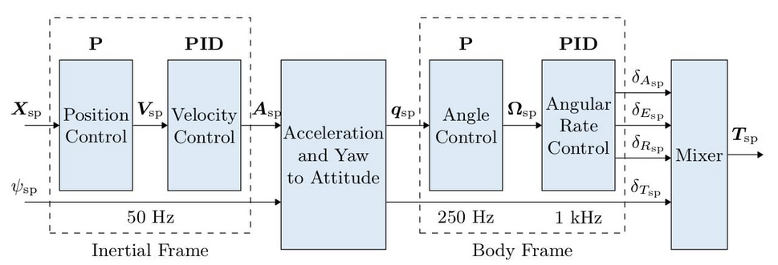

# TODO

- [x] (21/12/2023) Implementar controlador de posição e velocidade
    - [x] Frequência de atualização 50hz,
    - [x] **Entradas**: posição, velocidade, aceleração, psi 
    - [x] **Saídas**: empuxo total e atitude desejada (em quaternions ou Euler),
- [ ] (20-12-2023) No futuro imlementar controlador de posição, referência: [https://docs.px4.io/main/en/flight_stack/controller_diagrams.html](https://docs.px4.io/main/en/flight_stack/controller_diagrams.html).

- [x] (24/01/2024) Implementar controlador de attitude
    - [x] recebe o quaternio desejado. 
    - [x] produz os três torques.
    - [ ] Frequência de atualização 250Hz para os ângulos e 1KHz para os rates
- [x] Implementar o drone para receber as frequências angulares como tópicos.
  